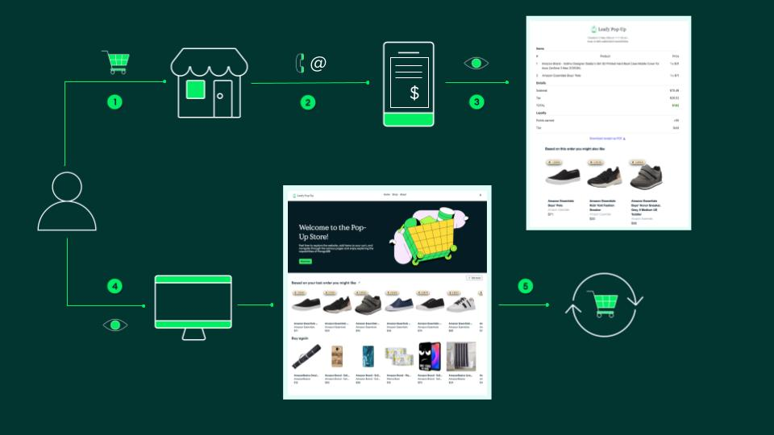
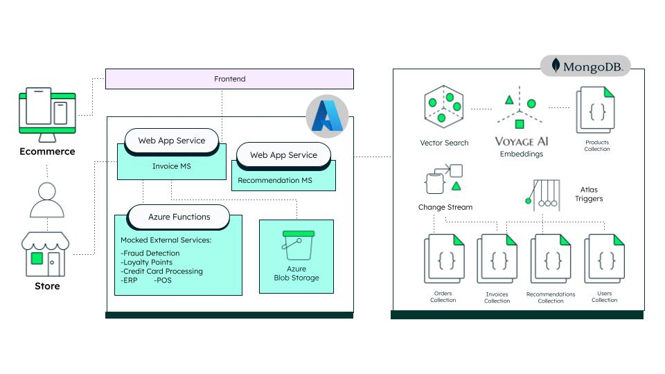

# 🛍️ Real-Time Personalization with Receipt Data

This demo showcases how retailers can turn digital receipts into personalized, AI-powered experiences using MongoDB Atlas. Built with event-driven microservices, this solution demonstrates how to centralize invoice data and use it in real time to enrich customer journeys.

---
## 🎯 Demo Goals

- Show how **Change Streams** and **Triggers** can power microservices in an event-driven architecture (EDA) 
- Highlight the power of **MongoDB Atlas** for flexible, document-based modeling and fast data retrieval
- Simulate **external system integrations** - such as taxes, fraud detection and loyalty points - quickly and easily via **Azure Functions**  
- Deliver real-time **personalized recommendations** using **MongoDB Vector Search** and **VoyageAI**
- Keep the architecture clean, reactive, and production-inspired, but demo-friendly  

---
## 🛠️ What This Demo Does

### 1 - ⚡ Event-Driven Invoice Creation  
> Leverage MongoDB Change Streams to automatically trigger invoice generation upon each order checkout, then persist rich, schema‑flexible invoice documents—allowing you to capture complex billing details and adapt your data model as requirements evolve.  

### 2 - 🧾 Download Invoice  
> Retrieve and display invoice files stored in Azure Blob Storage or generated on demand.  

### 3 - 🔮 AI‑Driven Personalized Recommendations  
> By capturing data—from receipt transactions to product‑catalog embeddings—in MongoDB’s flexible document model, you unlock your centralized data to power real‑time, purchase‑based recommendations. Vector Search generates instant suggestions, while Atlas Triggers and optimized document‑model schema design ensure lightning‑fast retrieval of user recommendations.

> 📌 _Image: 360° customer journey powered by real-time digital receipts, AI recommendations, and seamless sync across in-store and online activity._  

---

## 🧩 Architecture Overview

This demo showcases a modern event-driven architecture where the invoice microservice captures orders placed in our Leafy Pop-Up Store (mock e-commerce) and can be extended to ingest orders from physical stores. Using MongoDB Change Streams, this service is synchronized with the recommendation microservice, enabling the automatic generation of personalized suggestions—instantly synced into both the digital receipt and the customer’s homepage.

The invoice service simulates external integrations (e.g., tax calculation, loyalty programs) via Azure Functions, reflecting typical components involved in invoice creation. If needed, the invoice is rendered as a PDF and stored in Azure Blob Storage, providing a scalable and easily linkable unstructured file solution.

Recommendations are generated using MongoDB Atlas Vector Search with Voyage AI embeddings, enabling fast, semantic product matching.

At the core, MongoDB serves as the operational source of truth, activating and syncing receipt data in real time—making it readily available across the entire customer journey with speed, flexibility, and minimal complexity.

> 📌 _Image: Diagram of the components powering the demo_  



| Component                             | Tech         | Role                                                                 |
|---------------------------------------|--------------|----------------------------------------------------------------------|
| **Frontend & Order/User Management**  | Next.js      | User interface and order processing                                  |
| **Invoice & Recommendation Services** | Python       | Event-driven microservices hosted on Azure App Service               |
| **Azure Functions**                   | Python       | Simulates external services (e.g., tax, loyalty)                     |
| **Azure Blob Storage**                | Azure        | Stores unstructured data like PDF receipts                           |
| **MongoDB Atlas**                     | DBaaS        | Central operational data layer for the solution                      |
| **Voyage AI**                         | Embeddings   | Embedding model for product similarity search                        |

> 📝 _Note: This project is an extension of our previous demo, [Leafy Pop-Up Store](https://medium.com/mongodb/how-mongodb-brings-flexibility-and-speed-to-your-omnichannel-ordering-solution-728ec14957e7)._

---

## 🏗️ From High-Level Design to Implementation Details

This demo balances **macro-level architecture** with **implementation details** to showcase a fully event-driven flow powered by **MongoDB Change Streams**.

> For simplicity, we use an **in-memory queue in Python** — easily replaceable with production-ready tools like **Azure Service Bus**, **Event Grid**, **Storage Queues**, or **Kafka** via the [MongoDB Kafka Connector](https://www.mongodb.com/docs/kafka-connector/current/).

> 📌 _Image: Event-Driven Invoice Processing Internals_  


---

## 🗂️ Folder Structure

```bash
/services
  ├── invoice-ms/                         
  └── recommendation-ms/                 

/external
  └── atlas-triggers/       
  └── azure-functions/ 
docs/
  └── adr/

docker-compose.yml
Makefile
```
> 📝 _Note: Curious about how and why this system was designed?  
> Read the [ADR documentation](docs/adr/) (Architecture Decision Records) to explore the reasoning behind key architectural and modeling decisions._
---

## 📎 Related Components & Microservice Docs

Each microservice has its own README covering setup steps, required dependencies, external integrations, and how to run it independently.

- 📄 [`invoice-ms`](services/invoice-ms/README.md)
- 📄 [`recommendation-ms`](services/recommendation-ms/README.md)

> 🔗 To configure the frontend and backend for `order` and `user`, please refer to our previous demo — the starting point for this project: [retail-store-v2](https://github.com/mongodb-industry-solutions/retail-store-v2)

---
## 🐳 Getting Started – Run All Microservices Together

This project includes multiple microservices managed with Docker Compose and controlled via a Makefile.

### Prerequisites

- [Docker](https://www.docker.com/)
- [Docker Compose](https://docs.docker.com/compose/)
- [GNU Make](https://www.gnu.org/software/make/) (default on macOS/Linux)

> Please refer to the individual `README.md` files inside each service folder for more set up details.

>**Clone the repository:**
>    ```bash
 >   git clone https://github.com/mongodb-industry-solutions/retail-digital-receipts-backend.git
  >  cd retail-digital-receipts-backend
   > ```

### 🧪 Local Development Commands

| Command                         | Description                                                  |
|----------------------------------|--------------------------------------------------------------|
| `make build`                    | Build and start all services with Docker Compose.            |
| `make clean`                    | Stop and remove containers, volumes, and orphans.            |
| `make logs`                     | Tail logs from all local containers.                         |
| `make build-invoice`            | Build only the `invoice-ms` service locally.                 |
| `make build-recommendation`     | Build only the `recommendation-ms` service locally.          |
| `make stop-invoice`             | Stops only the `invoice-ms` service locally.                 |
| `make stop-recommendation`      | Stops only the `recommendation-ms` service locally.          |

---

### 🚀 Production Commands

> These commands use the Azure Container Registry specified in the `REGISTRY` variable.
> Before running `make build-prod` or `make deploy-prod`, make sure you're authenticated to Azure Container Registry:
>```bash
>az acr login --name <your-registry-name>
>```

| Command                              | Description                                                               |
|--------------------------------------|---------------------------------------------------------------------------|
| `make stop-prod`                    | Stop both Azure App Services (`invoice-ms`, `recommendation-ms`).         |
| `make stop-invoice-prod`            | Stop only Azure `invoice-ms`on Azure.                                     |
| `make stop-recommendation-prod`     | Stop only Azure `recommendation-ms`on Azure.                              |
| `make deploy-prod`                  | Builds, pushes, and deploys both microservices                            |
| `make deploy-invoice-prod`          | Builds, pushes, and deploys only `invoice-ms` to Azure.                   |
| `make deploy-recommendation-prod`   | Builds, pushes, and deploys only `recommendation-ms` to Azure.            |

---

## 💡 By storing your **invoice data in MongoDB**, you unlock a host of benefits:

- 🔐 **Security & Data Privacy**  
  MongoDB Atlas offers field-level encryption, role-based access control (RBAC), auditing, and network isolation, making it ideal for handling sensitive billing and customer data.

- 🌍 **Geographical Compliance & Sharding**  
  Global clusters and zone sharding help you comply with regulations like GDPR and CCPA while keeping data close to the user for low-latency access.

- 📊 **Workload Isolation for Analytics**  
  MongoDB enables real-time analytics on invoice data—using read-only secondaries or Atlas Data Federation—without disrupting core transaction workloads.

- 🔄 **From Data Silos to Seamless Access**  
  Invoice data often lives isolated in backend systems like ERPs or legacy databases, making real-time access difficult and creating silos that block innovation and personalization. By storing invoices as rich, flexible documents in MongoDB, you unlock seamless cross-service access and turn billing data into a driver for real-time insights and intelligent experiences.

---

## 👥 Authors

This project was made possible through a close collaboration between domain experts and technical implementers:

### Lead Authors *(Use Case Ideation & Retail Implementation)*
- [**Rodrigo Leal**](https://www.linkedin.com/in/rodrigo-leal-5b240121/) – Principal
- [**Prashant Juttukonda**](https://www.linkedin.com/in/cloudpkj/) – Principal  
- [**Genevieve Broadhead**](https://www.linkedin.com/in/genevieve-broadhead-271757bb/) – Global Lead, Retail Solutions  

### Developers & Maintainers *(Technical Design & Implementation)*
- [**Florencia Arin**](https://www.linkedin.com/in/floarin/) – Developer & Maintainer
- [**Angie Guemes**](https://www.linkedin.com/in/angelica-guemes-estrada/) – Developer & Maintainer  


---

## 📚 Related Demo Content Package *(Coming Soon)*

- **Solution Library** – *Coming soon...*
- **Youtube Video** – *Coming soon...*
 - **Blog** – *Coming soon...*
---
## License

© 2025 MongoDB. All rights reserved.

This repository is intended solely for demonstration and educational purposes.  
Commercial use is strictly prohibited without written permission from MongoDB.  
No support or warranty is provided. Use at your own risk.


