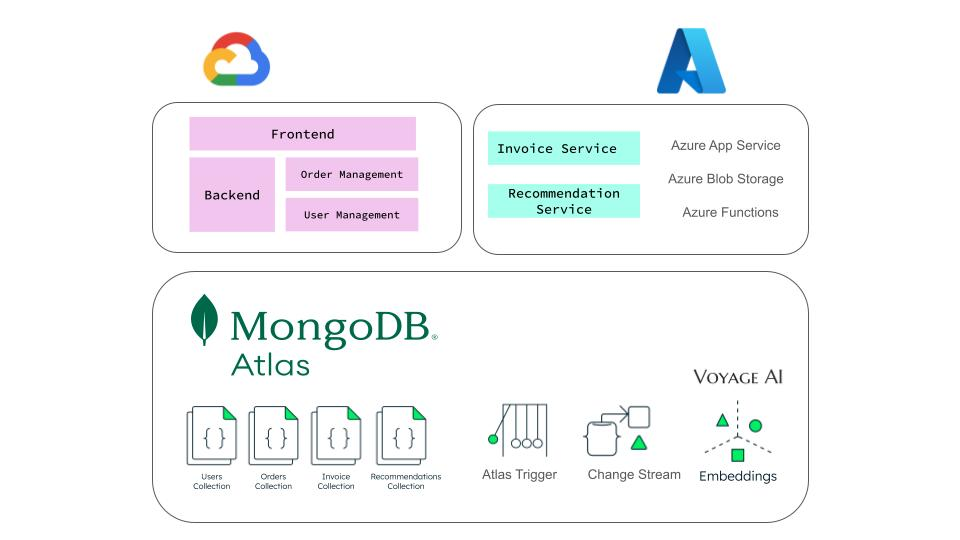
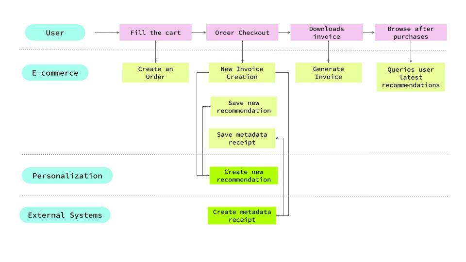

# 🧾 Retail Digital Receipt Demo / Event-Driven Microservices with MongoDB & Azure

This project showcases how to build a **document-centric, event-driven e-commerce architecture** using **MongoDB Atlas** and **Azure microservices**.

The solution simulates the generation of digital receipts and personalized recommendations.

---

## 🎯 Demo Goals

- Show how **Change Streams** and **Triggers** can power microservices in an event-driven architecture (EDA) 
- Highlight the power of **MongoDB Atlas** for flexible, document-based modeling and fast data retrieval
- Simulate **external system integrations** - such as taxes, fraud detection and loyalty points - quickly and easily via **Azure Functions**  
- Deliver real-time **personalized recommendations** using **MongoDB Vector Search** and **VoyageAI**
- Keep the architecture clean, reactive, and production-inspired, but demo-friendly  

> 💡 The frontend and core backend services (orders, users) are hosted on **Google Cloud Platform (GCP)**, while the microservices for invoices and recommendations are implemented in **Azure**.
---

## 🧩 Architecture Overview

> 📌 _Image: Adding Digital Receipts in Leafy Store_  



| Component        | Cloud | Role |
|------------------|-------|------|
| **Frontend & Order/User Management** | GCP (Next.js) | User interface and order processing |
| **Invoice & Recommendation Services** | Azure App Service | Event-driven invoice creation and instant recommendation for the user  |
| **MongoDB Atlas** | MongoDB Atlas | Centralized data layer for orders, invoices, users, and recommendations |
| **Azure Function** | Azure | Mocks external system metadata for invoices |
| **Voyage AI**     | External | Provides product vector emmbedings |

> 📝 _Note: While this demo uses a **single shared MongoDB Atlas database**, each collection could be deployed to **separate databases per service** in a production setup to enable more isolation, scalability, and data governance._

---

## 🔄 System Flow Highlights

> 📌 _Image: Purchase Workflow_  


---

### 👤 Use Cases In This Demo:

    ## ⚡ Event-Driven Invoice Creation  
      > Automatically generate invoices in response to new orders using MongoDB Change Streams
    ## 🧾 Download Invoice  
      > Retrieve and display invoice files stored in Blob Storage or generated on demand.
    ## 🧍 Instant Recommendation for the User  
      > Deliver personalized product suggestions based on recent purchases, using Vector Search.

---

## 🗂️ Folder Structure

```bash
/services
  ├── invoice-ms/                         
  └── recommendation-ms/                 

/external
  └── azure_function_invoice_mock.py       

docs/
  └── adr/

docker-compose.yml
.env.example
Makefile
```

---

## 📎 Go to Related Components for Setup Instructions and Microservice Details

- 📄 [`services/invoice-ms/README.md`](services/invoice-ms/README.md)  
- 📄 [`services/recommendation-ms/README.md`](services/recommendation-ms/README.md)  
- 📄 [`external/README.md`](external/README.md)  

🔗 To configure the frontend and backend for `order` and `user`, please refer to our previous demo — the starting point for this project: [retail-store-v2](https://github.com/mongodb-industry-solutions/retail-store-v2)

---

## 💡 By storing your **invoice data in MongoDB**, you unlock a host of benefits:

- 🔐 **Security & Data Privacy**  
  MongoDB Atlas offers field-level encryption, role-based access control (RBAC), auditing, and network isolation, making it ideal for handling sensitive billing and customer data.

- 🌍 **Geographical Compliance & Sharding**  
  Global clusters and zone sharding help you comply with regulations like GDPR and CCPA while keeping data close to the user for low-latency access.

- 📊 **Workload Isolation for Analytics**  
  MongoDB enables real-time analytics on invoice data—using read-only secondaries or Atlas Data Federation—without disrupting core transaction workloads.

- 🔄 **From Data Silos to Seamless Access**  
  Invoice data often lives isolated in backend systems like ERPs or legacy databases, making real-time access difficult and creating silos that block innovation and personalization. By storing invoices as rich, flexible documents in MongoDB, you unlock seamless cross-service access and turn billing data into a driver for real-time insights and intelligent experiences.


> 🧠 With MongoDB, storing invoices goes beyond persistence—it's the foundation for building a smart, secure, and insight-driven commerce platform.

---

## 👥 Authors & Contributors

This project was made possible through a close collaboration between domain experts and technical implementers:

### Lead Authors *(Use Case Ideation & Retail Implementation)*
- [**Rodrigo Leal**](https://www.linkedin.com/in/rodrigo-leal-5b240121/) – Principal
- [**Prashant Juttukonda**](https://www.linkedin.com/in/cloudpkj/) – Principal  
- [**Genevieve Broadhead**](https://www.linkedin.com/in/genevieve-broadhead-271757bb/) – Global Lead, Retail Solutions  

### Developers & Maintainers *(Technical Design & Implementation)*
- [**Florencia Arin**](https://www.linkedin.com/in/floarin/) – Developer & Maintainer
- [**Angie Guemes**](https://www.linkedin.com/in/angelica-guemes-estrada/) – Developer & Maintainer  


---

## 📚 Related Blogs *(Coming Soon)*

- **Blog 1** – *Coming soon...*
- **Blog 2** – *Coming soon...*


