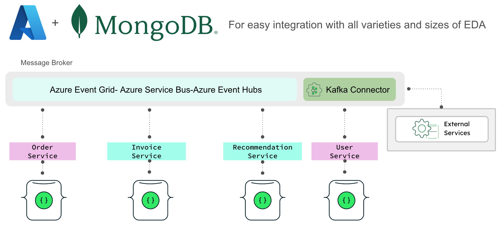

# 🧾 Retail Digital Receipt Demo / Event-Driven Microservices with MongoDB & Azure

This project showcases how to build a **document-centric, event-driven e-commerce architecture** using **MongoDB Atlas** and **Azure microservices**.

The solution simulates the generation of digital receipts and personalized recommendations.

---

## 🎯 Demo Goals

- Show how **Change Streams** and **Triggers** can power microservices in an event-driven architecture (EDA) 
- Highlight the power of **MongoDB Atlas** for flexible, document-based modeling and fast data retrieval
- Simulate **external system integrations** - such as taxes, fraud detection and loyalty points - quickly and easily via **Azure Functions**  
- Deliver real-time **personalized recommendations** using **MongoDB Vector Search** and **VoyageAI**
- Keep the architecture clean, reactive, and production-inspired, but demo-friendly  

---

## 🧩 Architecture Overview

> 📌 _Image: Adding Digital Receipts in Leafy Store_  


| Component                             | Cloud                   | Role                                                                 |
|---------------------------------------|-------------------------|----------------------------------------------------------------------|
| **Frontend & Order/User Management**  | GCP (Next.js)           | User interface and order processing, hosted on GCP                   |
| **Invoice & Recommendation Services** | Azure App Service (Python) | Event‑driven invoice creation and instant recommendations; microservices hosted on Azure App Service |
| **MongoDB Atlas**                     | MongoDB Atlas           | Centralized data layer for orders, invoices, users, and recommendations |
| **Azure Functions**                   | Azure (Python)          | Simulates external metadata service for invoices                     |
| **Azure Blob Storage**                | Azure                   | Secure, efficient storage of unstructured data                       |
| **Voyage AI**                         | External AI Service     | Provides product vector embeddings                                   |


> 📝 _Note: In this demo, services are distributed across different cloud providers (e.g., Azure for backend microservices and GCP for the frontend). This setup reflects our team's decision to experiment with cross-cloud scenarios. However, from an architectural perspective, all components can be deployed locally or within a single cloud provider, depending on your environment and preferences._

---

## 🔄 System Flow Highlights

> 📌 _Image: Purchase Workflow_  


---

## 👤 Use Cases In This Demo:

### 1 - ⚡ Event-Driven Invoice Creation  
> Leverage MongoDB Change Streams to automatically trigger invoice generation upon each order checkout, then persist rich, schema‑flexible invoice documents—allowing you to capture complex billing details and adapt your data model as requirements evolve.  

### 2 - 🧾 Download Invoice  
> Retrieve and display invoice files stored in Azure Blob Storage or generated on demand.  

### 3 - 🔮 AI‑Driven Personalized Recommendations  
> By capturing data—from receipt transactions to product‑catalog embeddings—in MongoDB’s flexible document model, you unlock your centralized data to power real‑time, purchase‑based recommendations. Vector Search generates instant suggestions, while Atlas Triggers and optimized document‑model schema design ensure lightning‑fast retrieval of user recommendations.

---

## 🏗️ From High-Level Design to Implementation Details

This demo balances **macro-level architecture** with **implementation details** to showcase a fully event-driven flow powered by **MongoDB Change Streams**.

> For simplicity, we use an **in-memory queue in Python** — easily replaceable with production-ready tools like **Azure Service Bus**, **Event Grid**, **Storage Queues**, or **Kafka** via the [MongoDB Kafka Connector](https://www.mongodb.com/docs/kafka-connector/current/).

> 📌 _Image: Event-Driven Invoice Processing Internals_  


---

## 🗂️ Folder Structure

```bash
/services
  ├── invoice-ms/                         
  └── recommendation-ms/                 

/external
  └── atlas-triggers/       
  └── azure-functions/ 
docs/
  └── adr/

docker-compose.yml
Makefile
```
> 📝 _Note: Curious about how and why this system was designed?  
> Read the [ADR documentation](docs/adr/) (Architecture Decision Records) to explore the reasoning behind key architectural and modeling decisions._
---

## 📎 Related Components & Microservice Docs

Each microservice has its own README covering setup steps, required dependencies, external integrations, and how to run it independently.

- 📄 [`invoice-ms`](services/invoice-ms/README.md)
- 📄 [`recommendation-ms`](services/recommendation-ms/README.md)

> 🔗 To configure the frontend and backend for `order` and `user`, please refer to our previous demo — the starting point for this project: [retail-store-v2](https://github.com/mongodb-industry-solutions/retail-store-v2)

---
## 🐳 Getting Started – Run All Microservices Together

This project includes multiple microservices managed with Docker Compose and controlled via a Makefile.

### Prerequisites

- [Docker](https://www.docker.com/)
- [Docker Compose](https://docs.docker.com/compose/)
- [GNU Make](https://www.gnu.org/software/make/) (default on macOS/Linux)

> Please refer to the individual `README.md` files inside each service folder for more set up details.

>**Clone the repository:**
>    ```bash
 >   git clone https://github.com/mongodb-industry-solutions/retail-digital-receipts-backend.git
  >  cd retail-digital-receipts-backend
   > ```

### 🧪 Local Development Commands

| Command                         | Description                                                  |
|----------------------------------|--------------------------------------------------------------|
| `make build`                    | Build and start all services with Docker Compose.            |
| `make clean`                    | Stop and remove containers, volumes, and orphans.            |
| `make logs`                     | Tail logs from all local containers.                         |
| `make build-invoice`            | Build only the `invoice-ms` service locally.                 |
| `make build-recommendation`     | Build only the `recommendation-ms` service locally.          |

---

### 🚀 Production Commands

> These commands use the Azure Container Registry specified in the `REGISTRY` variable.
> Before running `make build-prod` or `make deploy-prod`, make sure you're authenticated to Azure Container Registry:
>```bash
>az acr login --name retailistregistry
>```

| Command                              | Description                                                               |
|--------------------------------------|---------------------------------------------------------------------------|
| `make build-prod`                   | Build and push both services to the Azure Container Registry.             |
| `make deploy-invoice-prod`          | Build and push only `invoice-ms` to Azure Container Registry.             |
| `make deploy-recommendation-prod`   | Build and push only `recommendation-ms` to Azure Container Registry.      |
| `make deploy-prod`                  | Deploy both services to Azure (build + push for both).                    |
| `make stop-prod`                    | Stop both Azure App Services (`invoice-ms`, `recommendation-ms`).         |
| `make logs-invoice-prod`            | Tail logs from the `invoice-ms` Azure App Service.                        |
| `make logs-recommendation-prod`     | Tail logs from the `recommendation-ms` Azure App Service.                 |

---

## 💡 By storing your **invoice data in MongoDB**, you unlock a host of benefits:

- 🔐 **Security & Data Privacy**  
  MongoDB Atlas offers field-level encryption, role-based access control (RBAC), auditing, and network isolation, making it ideal for handling sensitive billing and customer data.

- 🌍 **Geographical Compliance & Sharding**  
  Global clusters and zone sharding help you comply with regulations like GDPR and CCPA while keeping data close to the user for low-latency access.

- 📊 **Workload Isolation for Analytics**  
  MongoDB enables real-time analytics on invoice data—using read-only secondaries or Atlas Data Federation—without disrupting core transaction workloads.

- 🔄 **From Data Silos to Seamless Access**  
  Invoice data often lives isolated in backend systems like ERPs or legacy databases, making real-time access difficult and creating silos that block innovation and personalization. By storing invoices as rich, flexible documents in MongoDB, you unlock seamless cross-service access and turn billing data into a driver for real-time insights and intelligent experiences.

---

## 👥 Authors

This project was made possible through a close collaboration between domain experts and technical implementers:

### Lead Authors *(Use Case Ideation & Retail Implementation)*
- [**Rodrigo Leal**](https://www.linkedin.com/in/rodrigo-leal-5b240121/) – Principal
- [**Prashant Juttukonda**](https://www.linkedin.com/in/cloudpkj/) – Principal  
- [**Genevieve Broadhead**](https://www.linkedin.com/in/genevieve-broadhead-271757bb/) – Global Lead, Retail Solutions  

### Developers & Maintainers *(Technical Design & Implementation)*
- [**Florencia Arin**](https://www.linkedin.com/in/floarin/) – Developer & Maintainer
- [**Angie Guemes**](https://www.linkedin.com/in/angelica-guemes-estrada/) – Developer & Maintainer  


---

## 📚 Related Blogs *(Coming Soon)*

- **Blog 1** – *Coming soon...*
- **Blog 2** – *Coming soon...*


