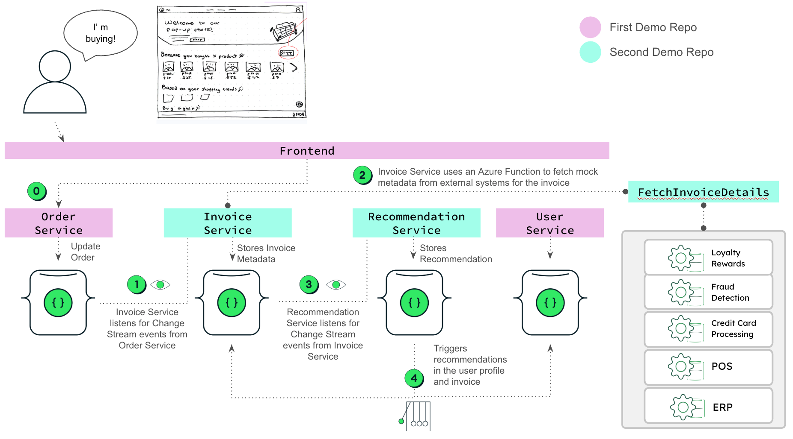
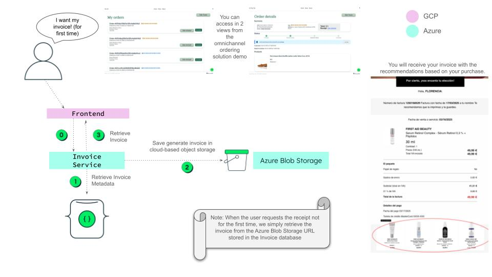

# 🧾 invoice-ms

Handles creation, enrichment, and rendering of invoices from new orders.  
Part of the retail demo system using MongoDB Change Streams, Azure Functions, Azure Blob Storage and Clean Architecture.

---

## 🔍 What it does

- Listens for new order inserts via MongoDB Change Streams
- Creates a new invoice based on the order
- Enriches it using an external Azure Function (mocked for demo)
- Stores the invoice in MongoDB
- Renders a PDF/image version of the invoice (on demand)
- Uploads the rendered file to Azure Blob Storage
- Provides an API to retrieve the invoice file

> If the invoice hasn't been rendered yet, the endpoint will trigger the rendering and return the result.  
> The rendered file includes **recommendations inserted by `recommendation-ms`** via an Atlas Trigger.

---

## 🏗️ Architecture Overview

### 1. Event-Driven Invoice Creation



- Change Stream detects `orders.insert`
- `invoice-ms` creates and saves invoice
- Calls Azure Function to enrich data (if available)

### 2. PDF Rendering On-Demand



- Endpoint `/invoices/{invoice_id}/file`
- If rendered file exists → returns it
- Else → triggers generation, uploads to Blob Storage, and returns link

> 📝 _Note: Curious about how and why this system was designed?  
> Read the [ADR documentation](../../docs/adr/) (Architecture Decision Records) to explore the reasoning behind key architectural and modeling decisions._

---
## 📦 Setup Instructions

> 👉 If you're looking to run the full system — including `recommendation-ms`, `invoice-ms`, Azure Functions, Atlas Triggers, the frontend, and order/user management — head to the [main project README](../../README.md) for a complete guide.


## 🔧 Prerequisites

Before running this service, make sure you have:

- **Python 3.10** installed (recommended version range: `>=3.10,<3.11`)
- **Poetry** installed for dependency management ([install guide](https://python-poetry.org/docs/#installation))
- Access to a **MongoDB Atlas cluster** ([get started here](https://www.mongodb.com/atlas/database))
- Load sample data from the [Retail Store Demo – MongoDB Industry Solutions](https://github.com/mongodb-industry-solutions/retail-store-v2/blob/main/resources/omnichannel/README.md)
- Create an **Azure Account** (if you don’t have one):  
  https://azure.microsoft.com/en-us/free/
---

## ☁️ Azure Setup (Blob Storage + Metadata Enrichment)

This service uses Azure Blob Storage to store rendered invoices, and also calls an Azure Function to enrich them.

### Step 1 - Install Azure CLI

```bash
brew install azure-cli  # For macOS
```

Or follow instructions here:  
https://learn.microsoft.com/en-us/cli/azure/install-azure-cli

### Step 2 - Login to Azure

```bash
az login
```

### Step 3 - Grant Access to Blob Storage (via Azure Portal)

To allow the service to upload files to Azure Blob Storage, follow these steps in the Azure Portal:

1. Go to your **Storage Account**.
2. In the left sidebar, open **Access Control (IAM)**.
3. Click **Add role assignment**.
4. Select the following options:
   - **Role**: Storage Blob Data Contributor
   - **Assign access to**: Managed identity (or App registration, depending on your setup)
   - **Select member**: Choose the identity your service is using
5. Click **Review + assign**.

This grants your service write access to the container so it can upload invoices.

### Step 4 - Create Azure Function

- Create your own Azure Function using the official documentation: [Create your first function in Azure](https://learn.microsoft.com/en-us/azure/azure-functions/functions-create-function-app-portal?pivots=programming-language-python)
- Use the example provided in this repo: [See example Azure Function implementation](../../external/azure-functions)

---

## 🛠  Project setup:

- Clone the repo and navigate to `services/invoice-ms`
- Create a `.env` file based on `.env.EXAMPLE`
```bash
cp .env.EXAMPLE .env
```
Make sure to update the variables in .env with your own MongoDB URI, Azure credentials, and function URL before running the service.
- Install dependencies
```bash

poetry install
```

---

## ▶️ Run the MS (Local, No Docker)


3. Run the following:

```bash
# Start the FastAPI server
poetry run uvicorn main:app --host 0.0.0.0 --port 8000
```
## 🐳 Run with Docker

You can run `invoice-ms` in an isolated container using Docker.

### 🛠️ 1. Build the Docker image

```bash
docker build -t invoice-ms .
```

This command:

- Uses the Dockerfile in the current directory (.) to build a Docker image.
- Installs all system dependencies (e.g., for PDF rendering with WeasyPrint).
- Uses Poetry to install your Python dependencies (as defined in pyproject.toml).
- Copies your application code into the image.
- Tags the image as invoice-ms so you can run it later by that name.
- The final result is a self-contained image that runs the invoice microservice with all its dependencies.

### ▶️ 2. Run the container

```bash
docker run --env-file .env -p 8000:8000 invoice-ms
```
This command:

- Loads environment variables from your local .env file (used by Pydantic settings).
- Starts the container using the invoice-ms image you built earlier.
- Maps port 8000 of the container to port 8000 on your host machine — this is important because the service runs a FastAPI app via Uvicorn, which listens on port 8000.
- Makes the HTTP API available at http://localhost:8000
- Starts background tasks such as the MongoDB Change Stream listener and invoice generation logic.

---
