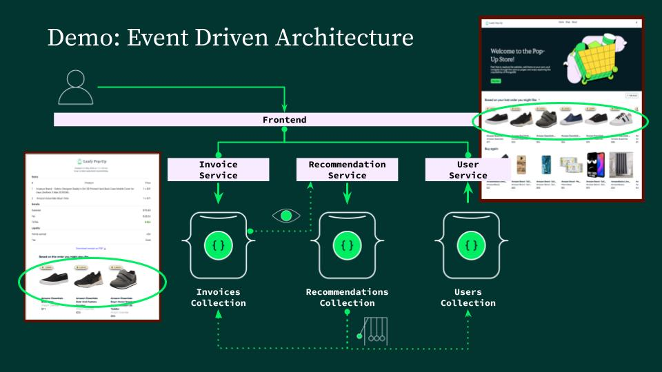
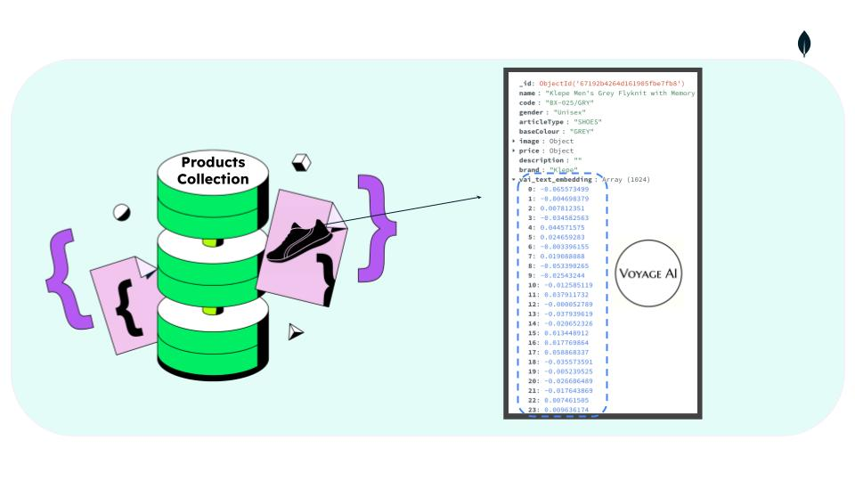
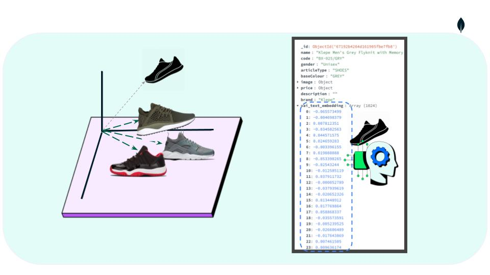

# 🔮 recommendation-ms

Generates personalized product suggestions based on new purchases.  
Built with MongoDB Atlas Vector Search, asynchronous queues, and a clean architecture approach.

---

## 🔍 What it does

Every time an invoice is created, `recommendation-ms`:

1. Listens to new invoice inserts via MongoDB Change Streams, and extracts the most expensive product from the invoice.
2. Retrieves its vector embedding (pre-computed with Voyage AI, stored in the `products` collection).
3. Performs a vector similarity search against the `products` catalog using MongoDB Atlas Vector Search.
4. Selects the top similar products and wraps them into a `RecommendationGroup`.
5. Stores the result in the `recommendations` collection.
> 💡 _Note: Once the recommendation is saved, an [Atlas Trigger](../../external/atlas-triggers) (outside this service) automatically propagates the data to:_
>
> - `users.lastRecommendations`  
> - `invoices.recommendations`
>
>_This allows the frontend to display results directly from user and invoice documents — no extra API calls needed.  
> And invoices come pre-filled with recommendations, ready for rendering._

---

## 🧩 Architecture Diagram



---

## 🧠 Architecture Design

- **Event-Driven Choreography**  
  Each service reacts to MongoDB inserts; no service calls another directly.

- **Event-Carried State Transfer (ECST)**  
  The entire recommendation payload is stored in `recommendations`. The Trigger simply copies that document to other collections.

- **Separation of Concerns**  
  `recommendation-ms` only writes to its own collection. Updates to `users` and `invoices` are handled externally by the Atlas Trigger.

> 📝 _Note: Curious about how and why this system was designed?  
> Read the [ADR documentation](../../docs/adr/) (Architecture Decision Records) to explore the reasoning behind key architectural and modeling decisions._

---
## 🧬 How Vector Search Works

In this demo, the `products` collection stores both traditional attributes — like name, price, and category — and **AI-generated vector embeddings** that capture the *semantic meaning* of each product.

These embeddings are generated using [Voyage AI](https://www.voyageai.com/) and stored in a dedicated field (e.g., `vai_text_embedding`). MongoDB Atlas Vector Search then uses these embeddings to perform similarity queries.

This is how real-time recommendations happen:

1. After a new invoice is inserted, we extract the most expensive product.
2. We retrieve its vector embedding.
3. We run a **$vectorSearch** query against the `products` collection.
4. MongoDB returns the most semantically similar items — based not just on keywords or categories, but on meaning.
5. These items are saved as a `RecommendationGroup` for the user and invoice.

This design lets us combine the flexibility of MongoDB documents with the power of modern AI — all inside the same database.




> 👉 [ADR 0009 – Why Product Vector Search Lives in recommendation-ms](../../docs/adr/0009-product-vector-search-in-recommendation.md)
---

## 📦 Setup Instructions

> 👉 If you're looking to run the full system — including `recommendation-ms`, `invoice-ms`, Azure Functions, Atlas Triggers, the frontend, and order/user management — head to the [main project README](../../README.md) for a complete guide

## 🔧 Prerequisites

Before running this service, make sure you have:

- **Python 3.10** installed (recommended version range: `>=3.10,<3.11`)
- **Poetry** installed for dependency management ([install guide](https://python-poetry.org/docs/#installation))
- Access to a **MongoDB Atlas cluster** ([get started here](https://www.mongodb.com/atlas/database))
- You can load a sample product catalog **with Voyage AI embeddings** from this repo:  
  [Retail Store Demo – MongoDB Industry Solutions](https://github.com/mongodb-industry-solutions/retail-store-v2/blob/main/resources/omnichannel/README.md)
- A **vector index** created on the embedding field in the `products` collection ([click here for more information](https://www.mongodb.com/docs/atlas/atlas-vector-search/))
- An [Atlas Trigger](../../external/atlas-triggers) configured to listen to `recommendations.insert` and copy data into:
  - `users.lastRecommendations`
  - `invoices.recommendations`

---

## 🛠  Project setup:

- Clone the repo and navigate to `services/recommendation-ms`
- Create a `.env` file based on `.env.EXAMPLE`
```bash
cp .env.EXAMPLE .env
```
Make sure to update the variables in `.env` with your own MongoDB URI and vector search settings — such as the name of the embedding field and the vector index used in the `products` collection.
- Install dependencies
```bash

poetry install
```

---

## ▶️ Run (Local, No Docker)


Run the following:

```bash
# Start the application
poetry run python main.py
```
## 🐳 Run with Docker

You can run `recommendation-ms` in an isolated container using Docker.

🛠️ Build the Docker image

```bash
docker build -t recommendation-ms .
```
This command:

- Uses the Dockerfile in the current directory (.) to build a Docker image.
- Installs all dependencies via Poetry.
- Tags the image as recommendation-ms, so you can reference it later.
- Packages your app code, including the .env file at runtime (though not embedded in the image).
- Result: You now have a Docker image locally called recommendation-ms that can run your microservice.

▶️ Run the container

```bash
docker run --env-file .env recommendation-ms
```
This command:

- Loads environment variables from your local .env file.
- Starts a new container from the recommendation-ms image.
- Executes poetry run python main.py inside the container (defined in CMD).
- Starts your background listener for MongoDB Change Streams.
- Exposes port 80 only for a minimal health check endpoint (used to keep the container alive in environments like Azure App Service). No public API is exposed.

---
## License

© 2025 MongoDB. All rights reserved.

This repository is intended solely for demonstration and educational purposes.  
Commercial use is strictly prohibited without written permission from MongoDB.  
No support or warranty is provided. Use at your own risk.