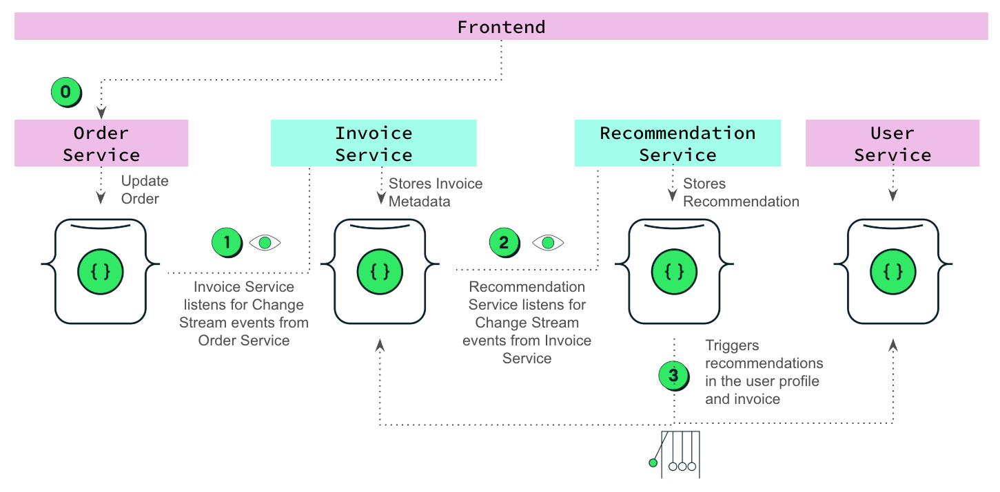

# 🔮 recommendation-ms

Generates personalized product suggestions based on new purchases.  
Built with MongoDB Atlas Vector Search, asynchronous queues, and a clean architecture approach.

---

## 🔍 What it does

Every time an invoice is created, `recommendation-ms`:

1. Listens to new invoice inserts via MongoDB Change Streams, and extracts the most expensive product from the invoice.
2. Retrieves its vector embedding (pre-computed with Voyage AI, stored in the `products` collection).
3. Performs a vector similarity search against the `products` catalog using MongoDB Atlas Vector Search.
4. Selects the top 4 similar products and wraps them into a `RecommendationGroup`.
5. Stores the result in the `recommendations` collection.
> 💡 _Note: Once the recommendation is saved, an **Atlas Trigger** (outside this service) automatically propagates the data to:_
>
> - `users.lastRecommendations`  
> - `invoices.recommendations`
>
>_This allows the frontend to display results directly from user and invoice documents — no extra API calls needed.  
> And invoices come pre-filled with recommendations, ready for rendering._

---

## 🧩 Architecture Diagram



---

## 🧠 Architecture Design

- **Event-Driven Choreography**  
  Each service reacts to MongoDB inserts; no service calls another directly.

- **Event-Carried State Transfer (ECST)**  
  The entire recommendation payload is stored in `recommendations`. The Trigger simply copies that document to other collections.

- **Separation of Concerns**  
  `recommendation-ms` only writes to its own collection. Updates to `users` and `invoices` are handled externally by the Atlas Trigger.

> 📝 _Note: Curious about how and why this system was designed?  
> Read the [ADR documentation](../../docs/adr/) (Architecture Decision Records) to explore the reasoning behind key architectural and modeling decisions._

---

## 📦 Setup Instructions

> 👉 If you're looking to run the full system (including `invoice-ms`, Azure Functions, and shared MongoDB setup), head to the [main project README](../../README.md) for a complete guide.

## 🔧 Prerequisites

- Python 3.10 (recommended)
- Poetry installed ([guide](https://python-poetry.org/docs/#installation))
- Access to a MongoDB Atlas cluster with Change Streams enabled

### Running this service in isolation

You can run `recommendation-ms` independently for development or testing purposes.

1. Copy the environment config:
   - Duplicate `.env.example` as `.env` and update the values.

2. Make sure the following prerequisites are ready in your MongoDB Atlas cluster:
   - ✅ Embeddings are stored in the `products.embedding` field  
   - ✅ A vector index named `product_vector_index` exists  
   - ✅ An [Atlas Trigger](../../external/atlas-triggers) is configured to listen for `recommendations.insert` and update:
     - `users.lastRecommendations`
     - `invoices.recommendations`


3. Then you can run the service either way:

**Using Poetry**
```bash

poetry install
poetry shell
uvicorn main:app --reload
```

**Or using Docker**
```bash

docker build -t recommendation-ms .
docker run --env-file .env -p 8000:8000 recommendation-ms
```
---

